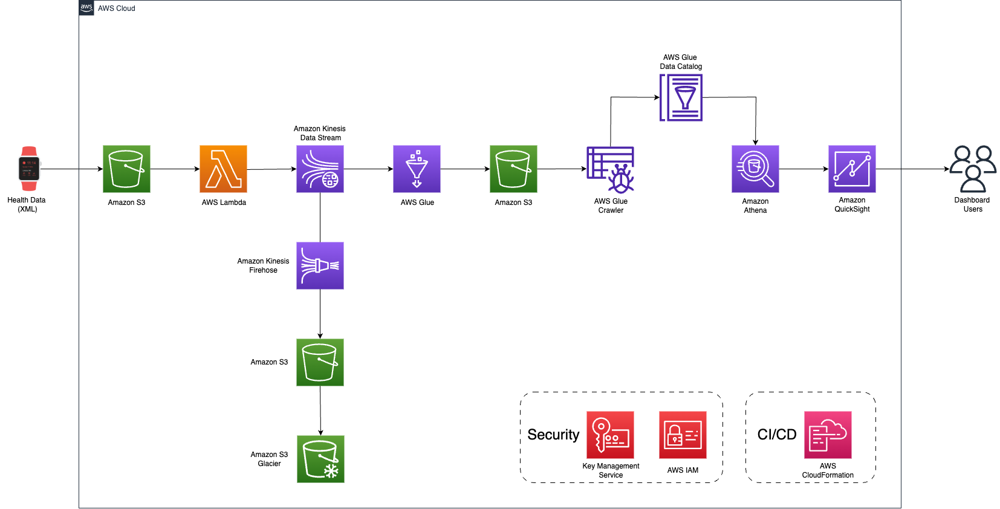

# Physical Analytics
By Javil Patel

## Table of Contents

1. [Summary](#Summary)
2. [Structure](#Structure)
3. [Usage](#Usage)
4. [Output](#Output)
5. [Architecture](#Architecture)
6. [Lambda Scripts](#Lambda-Scripts)
    * [json_producer.py](#json-producer.py)
    * [glue_script.py](#glue-script.py)
7. [SQL Statements](#SQL-Statements)
8. [Upload Health File](#Upload-Health-File)

## Summary

This application allows users to utilize their health metrics, which will then be transformed and prepared to create a dashboard. The data is from the ios health app. With the dashboard, users can see trends and insights into their physical activities. These insights can then be used to track progression in areas such as weight loss, exercise, sleep quality, or other health-related goals. Additionally, the dashboard can spot unusual patterns that might indicate potential health issues requiring attention.

## Structure

This application simulates near real time streaming which can be added on. Stearming data into Kinesis Data Streams using a Lambda Function. Kinesis Data Firehose captures the data and stores it in a Simple Store Service bucket which has a lifecycle policy. This policy will send the data to a S3 Glacier bucket after 14 days. AWS Glue will extract the data and applymapping for the schema of the data, change data types, and hash device ID for HIPAA compliance. Glue will load the data into a S3 bucket where glue crawler will store the metadata into Data Catalog. Using Athena and Quicksight, you can query the data by adding dataset to quicksight to show a dashboard. All the services are HIPAA capable so I used KMS keys to encypt the data at rest and this will follow HIPAA compilance. 

[CDK Stack](physical_analytics/physical_analytics_stack.py)

CDK stack to provision the architecture. Using AWS cloudFormation templates to build consistent environments and faster deployments.

[Lambda Function](lambda/json_producer.py)

Lambda code to convert xml data to json and parse the xml data.

[Glue Script](glue/glue_script.py)

Glue code to read streaming data, apply transformations, and load into a s3 bucket.

[Steps Dataset](Quicksight_Datasets/stepsdataset.sql)

This SQL statment queries the steps data and parses the data to be by date instead by minutes. 

[HeartRate Dataset](Quicksight_Datasets/heartratedataset.sql)

This SQL statment queries the average heart rate data and parses the data to be by date instead by minutes.

[Distance Traveled Dataset](Quicksight_Datasets/distancedataset.sql)

This SQL statment queries the distance traveled data and parses the data to be by date instead by minutes.

[Active Calories Dataset](Quicksight_Datasets/activecaloriesdataset.sql)

This SQL statment queries the active calories burned data and parses the data to be by date instead by minutes.

[Resting Calories Dataset](Quicksight_Datasets/restingcaloriesdataset.sql)

This SQL statment queries the resting calories burned and parses the data to be by date instead by minutes.

## Usage

This application can be used by individuals who want to track their own health metrics to view trends or insights. Healthcare professionals can also use this dashboard to monitor their clients' or patients' physical activities and suggest improvements in metrics that are not accomplishing the patients' goals. Using the Cloud Development Kit, to deploy this stack run `cdk deploy` in the root directory. This CDK deploys all the services that will be used for this application with the correct configurations. This will also deploy the roles and create the KMS keys used for encyption at rest. Must change the s3 buckets names as they must be unique globally and the file directory in upload.py

## Output

The physical analytics dashboard provides step counts, average heart rate, distance traveled, resting calories burned, and active calories burned. These datasets were created with SQL queries that select the value and dates for these values, and more metrics can be added depending on the use case.

## Architecture

Architecture Diagram 

## Lambda Scripts

## json-producer.py
The Lambda function is triggered by an event that occurs when a new file is added to a specified S3 bucket. The function reads the XML file and parses it. The JSON records are accumulated into a batch, and once the batch reaches the specified size, it's sent to the Kinesis Data Stream. The function uses a UUID as the partition key to send the data to different shards in the stream. 

## glue-script.py
This script initializes the Spark and Glue contexts, job parameters, and sets up paths for the output data The script reads data from a specified Kinesis Data Stream, defined by the database health_database and the table health_table. A mapping is applied to the incoming dynamic frame to ensure that the data conforms to the required schema. Hashing is applied to the 'device' column to encrypt the device information. The transformed and encrypted data is then written to a S3 bucket. The data written to S3 is in JSON format.

## SQL Statements
This SQL statements parse the dates to be by date and they sum the values of the steps, distance, and calories. For heart rate, it takes the average of the day. I also have the calculated fields that I used to display the 1st of every month for steps and heart rate. 

## Upload Health File
This script allows the user to upload their health data from their computer to a s3 bucket in their account. 
